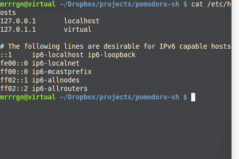

###pomodoro.sh

This script will notify the user when to work and when to rest in intervals as specified at http://en.wikipedia.org/wiki/Pomodoro_Technique.  It also alters your hosts file to blacklist any distracting sites during work intervals.

notifications are sent out via terminal-notifier http://rubygems.org/gems/terminal-notifier on OS X or pynotify2 on Linux

</img>

#### python-notify2

On Linux you'll need to install this library, on Ubuntu try:
<code>sudo apt-get install python-notify2</code>

####  Install & Run
<code>
make
</code>

Start it up in the background....
<code>
sudo pomodoro start &
</code>

Stop it gracefully....
<code>
sudo pomodoro stop
</code>

Or, just run ./pomodoro.sh (stop|start)

#### Block Domains While Working
Create/edit a file called .pomodoro.urls.blacklist in your home folder.  Each of the domains in the file will be blacklisted during each work session.

&gt; cat ~/.pomodoro.urls.blacklist

facebook.com 
news.ycombinator.com 
reddit.com 

